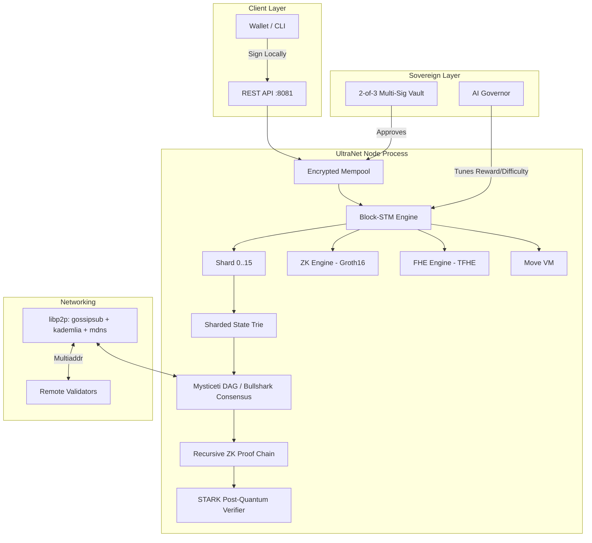
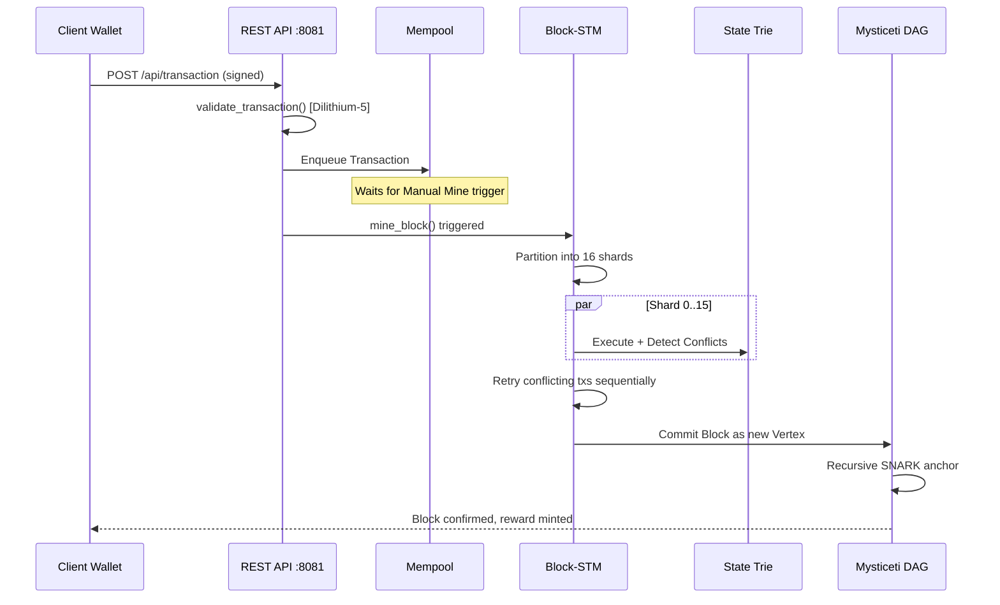
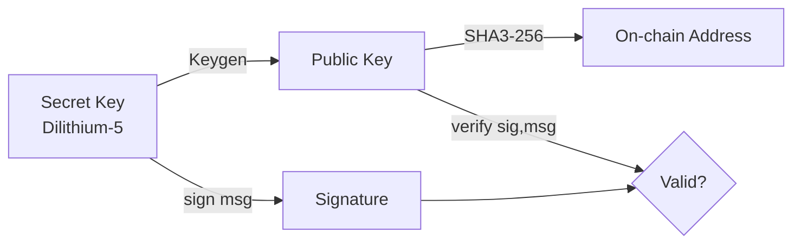
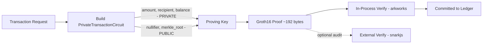
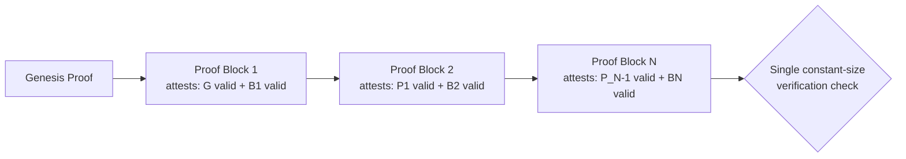
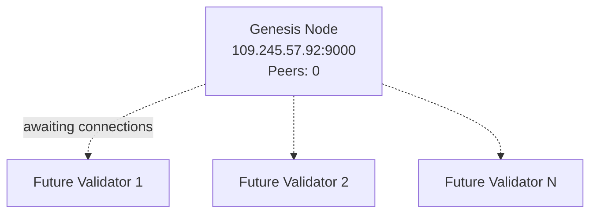
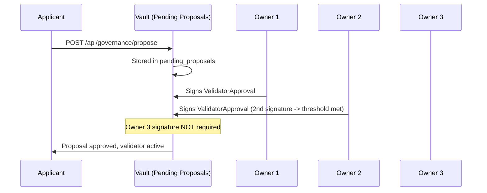
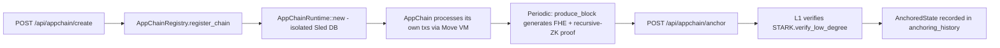
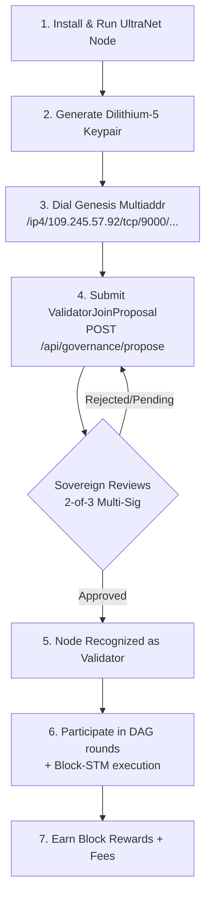

<!--
Copyright (c) 2026 Vladan Jotov.

This documentation is licensed under the ISC License. You may use, copy,
modify, and/or distribute it for any purpose with or without fee, provided
that this copyright notice and the license notice are retained. See LICENSE
at the repository root. Third-party materials remain under their respective
licenses.
-->
# 🛡️ UltraNet v7.1: The Sovereign Technical Guide

**Official Protocol Documentation | 100-Year Longevity Engine**

**Document Version:** 7.1 Sovereign
**Classification:** Public / Educational
**Author and Copyright Holder:** Vladan Jotov

> **Source of Truth:** `genesis.json` is the definitive source for UltraNet sovereign genesis configuration, including the sovereign address, network parameters, and initial token allocations.

**Signature Scheme:** Dilithium-5 (Post-Quantum, Lattice-based)
**Consensus:** Bullshark / Mysticeti DAG

---

## Table of Contents

1. Executive Summary
2. Protocol Philosophy & Design Goals
3. System Architecture Overview
4. The UltraNet Mining Lifecycle (Deep Dive)
5. Block-STM: Parallel Execution Engine
6. Consensus: Mysticeti DAG & Bullshark
7. Cryptographic Foundations
8. Privacy Layer: Zero-Knowledge Proofs
9. Fully Homomorphic Encryption (FHE) Engine
10. Recursive SNARKs & Proof Chaining
11. STARK Engine & Post-Quantum Verifiability
12. State Management: Sharded Merkle Patricia Trie
13. Cross-Shard Messaging & Atomicity
14. The Move Virtual Machine
15. Networking Layer (P2P / libp2p)
16. Sovereign Governance & 2-of-3 Multi-Sig
17. AI Governor: Autonomous Difficulty Tuning
18. AppChains: Layer-3 Sub-Networks
19. Dashboard Interface: Complete Visual Reference
20. REST API Reference
21. Tokenomics & Economic Model
22. How the Public Earns $ULTRA
23. Validator Onboarding: Step by Step
24. Node Operations & Maintenance
25. Security Model & Threat Analysis
26. Disaster Recovery & Key Management
27. Performance Benchmarks
28. Troubleshooting Guide
29. Glossary of Terms
30. Frequently Asked Questions
31. Appendix A: Constants Reference
32. Appendix B: Data Structure Reference
33. Roadmap
34. Official Seal & Attestation

---

## 1. Executive Summary

UltraNet is a Layer-1 sovereign blockchain protocol engineered for a **100-year operational horizon**. It combines **post-quantum cryptography (Dilithium-5)**, **massively parallel transaction execution (Block-STM across 16 shards)**, **privacy-preserving computation (Zero-Knowledge proofs and Fully Homomorphic Encryption)**, and an **autonomous AI Governor** that continuously tunes network parameters to preserve long-term sustainability.

Unlike traditional chains that rely on either pure Proof-of-Work or simple Proof-of-Stake, UltraNet is bootstrapped by a **Sovereign Genesis Authority** — a 2-of-3 multi-signature vault that controls the initial validator onboarding process until the network reaches sufficient decentralization. This guide documents every technical subsystem, every dashboard control, and the exact economic mechanism by which external participants earn the native token, **$ULTRA**.

This document is intentionally exhaustive. It is meant to serve simultaneously as:

* A **public-facing explainer** for prospective validators and community members.
* An **internal reference** for the Sovereign Genesis operator (you).
* A **technical audit trail** describing the exact behavior of the code in `src/`.

---

## 2. Protocol Philosophy & Design Goals

UltraNet was designed around five non-negotiable pillars:

|Pillar|Description|Primary Mechanism|
|-|-|-|
|**Longevity**|The protocol must remain economically and cryptographically viable for 100 years.|Post-quantum signatures, halving schedule, AI-tuned emission|
|**Privacy by Default**|Transaction amounts and balances should not be trivially public.|ZK-SNARKs (Groth16) + FHE (TFHE)|
|**Horizontal Scale**|Throughput should scale with CPU core count, not just block size.|Block-STM, 16-way sharding|
|**Sovereign Bootstrapping**|A new chain needs a trusted anchor before it can decentralize safely.|2-of-3 Multi-Sig Genesis Vault|
|**Self-Regulation**|The network should not need constant manual governance votes for routine tuning.|AI Governor + Sustainability Score|

### 2.1 Why Post-Quantum Now?

Classical ECDSA/EdDSA signatures are vulnerable to Shor's algorithm once sufficiently large quantum computers exist. Because UltraNet targets a multi-decade lifespan, it adopts **Dilithium-5**, a NIST-standardized lattice-based signature scheme, from Genesis — avoiding a costly future migration that would require re-signing the entire historical ledger.

### 2.2 Why Sharding via Block-STM Instead of Sub-Chains?

Sub-chain / sidechain architectures fragment liquidity and require bridges (a common attack vector). UltraNet instead keeps a **single unified state** but executes transactions optimistically in parallel across 16 logical shards using **Block-STM** (a technique pioneered by Aptos/Diem), falling back to sequential re-execution only when a genuine conflict is detected.

---

## 3. System Architecture Overview



### 3.1 Process Boundaries

The entire stack above runs inside a **single Rust binary** (`UltraNet`), bound to two ports:

* **`9000/tcp`** — P2P gossip and block sync (libp2p).
* **`8081/tcp`** — REST API and dashboard (actix-web).

### 3.2 Module Map (from `src/`)

```text
src/
├── lib.rs              → Core blockchain, Transaction, QuantumKeyPair, mine_block
├── api.rs               → REST endpoints (actix-web handlers)
├── main.rs               → Process entrypoint, boot sequence
├── block_stm.rs          → Parallel execution engine (16-shard STM)
├── p2p.rs                → libp2p networking, gossip, peer discovery
├── move_vm.rs            → Move VM integration (smart contracts)
├── fhe_engine.rs          → TFHE homomorphic encryption engine
├── zk_circuit.rs          → Groth16 circuits (PrivateTransactionCircuit)
├── zk_verifier.rs         → snarkjs-based external proof verification
├── recursive_zk.rs        → Recursive SNARK chaining
├── stark_engine.rs        → FRI-based STARK proofs (post-quantum)
├── state_trie.rs          → 16-shard Merkle Patricia Trie + pruning
├── cross_shard.rs         → Cross-shard atomic messaging
├── async_validator.rs      → Async/pipelined BLS-style validation
├── shared_storage.rs       → Sled-backed shared storage abstraction
└── appchain/
    ├── mod.rs             → AppChain module root
    ├── factory.rs          → AppChainRegistry, AnchoredState
    └── runtime.rs          → Isolated L3 execution runtime
```

---

## 4. The UltraNet Mining Lifecycle (Deep Dive)

Mining in UltraNet is the process of converting pending transactions into an immutable, cryptographically anchored state transition. The full sequence:

### 4.1 Step One — Local Signing (Client Side)

The private key **never leaves the client**. The wallet computes:

```text
message = SHA3-256(
    sender ||
    recipient ||
    amount.to_le_bytes() ||
    fee.to_le_bytes() ||
    timestamp.to_le_bytes() ||
    nullifier ||
    nonce.to_le_bytes() ||
    gas_limit.to_le_bytes() ||
    gas_price.to_le_bytes()
)
signature = Dilithium5.sign(secret_key, message)
```

This exact byte ordering is replicated server-side in `create_transaction_message()` — any deviation invalidates the signature.

### 4.2 Step Two — Submission & Mempool Entry

`POST /api/transaction` receives `{ sender, sender_public_key, recipient, amount, fee, nonce, timestamp, nullifier, gas_limit, gas_price, signature }`. The node:

1. Validates the `nullifier` is exactly 32 bytes (`parse_nullifier`).
2. Generates a ZK proof binding the nullifier to the private amount/recipient (`PrivateTransactionCircuit`).
3. Constructs a full `Transaction` struct and calls `blockchain.add_transaction(tx)`.
4. `add_transaction` internally calls `validate_transaction`, which performs the **real Dilithium-5 verification** — confirming the signature matches the claimed sender's public key and that the derived address (`SHA3-256(public_key)`) equals `tx.sender`.
5. On success, the transaction enters the **Encrypted Mempool**.

### 4.3 Step Three — Manual Mine Trigger

When the operator clicks **`Manual Mine`** (or `POST /api/mine` is called):

1. **Partitioning:** Up to 1000 pending transactions are pulled and classified: `StandardTransfer`, `MoveCall`/`MoveDeploy`, `ValidatorJoinProposal`/`ValidatorApproval`.
2. **16-Way Sharding:** Each transaction is assigned to one of 16 shards, typically derived from a hash of the sender address.
3. **Block-STM Execution:** See Section 5 for the full optimistic-concurrency algorithm.
4. **Merkle Commitment:** All transaction hashes are folded into a Merkle tree; the root becomes part of the block header.
5. **State Root Computation:** The `ShardedStateTrie` is updated across all 16 shards; a combined state root is produced.
6. **ZK/FHE Finalization:** Where private transfers or FHE operations occurred, proofs are attached (`last_fhe_proof`, Groth16 proof bytes).
7. **DAG Vertex Creation:** The new block becomes a vertex in the **Mysticeti DAG**, referencing prior vertices per the Bullshark consensus rule.
8. **Recursive Proof Update:** A new recursive SNARK is generated, cryptographically anchoring this block on top of the entire prior proof chain (`RecursiveZKEngine::create_recursive_proof`).
9. **Reward Distribution:** `GENESIS_REWARD` (50.0 $ULTRA) is minted to the miner's address; all transaction fees in the block are also credited to the miner.

### 4.4 Step Four — Persistence & Broadcast

The finalized block is written to the `sled`-backed `SharedStorage`, and gossiped to peers over the `ultra-net` libp2p topic so other validators can verify and append it to their local chain.

### 4.5 Sequence Diagram



---

## 5. Block-STM: Parallel Execution Engine

Block-STM (Software Transactional Memory for Blocks) is the mechanism that allows UltraNet to process transactions concurrently while guaranteeing the exact same final state as strict sequential execution.

### 5.1 Core Data Structure: MultiVersionMemory

Every write to state is versioned by `(shard_id, transaction_index)`. Readers see the latest version written by any transaction *before* them in the canonical (pre-assigned) order — not necessarily the physical execution order.

### 5.2 Optimistic Execution Algorithm

1. All transactions in the current batch are assigned a fixed logical order (index 0..N).
2. Each transaction executes **speculatively** against the `MultiVersionMemory`, recording its **read-set** and **write-set**.
3. After each pass, `detect_conflicts()` compares read-sets against writes made by earlier-indexed transactions that occurred *after* the read was taken.
4. Any transaction with an invalidated read-set is marked for **re-execution**.
5. This repeats until no conflicts remain, or `max_retries` is exceeded (in which case the transaction is deferred to the next block).

### 5.3 Why This Matters for Throughput

On an 8-core machine, most transaction batches (which rarely touch overlapping accounts) achieve near-linear speedup — this is the origin of the **506 ms FHE Proving Time** and sub-second block times seen on the dashboard even before hardware acceleration.

### 5.4 STM Statistics Exposed via API

`GET /api/stm/stats` returns:

|Field|Meaning|
|-|-|
|`stm_total_executions`|Total transaction execution attempts (including retries)|
|`stm_conflicts`|Number of detected read/write conflicts|
|`stm_retries`|Number of transactions that had to be re-executed|
|`stm_peak_parallelism`|Maximum number of transactions executed concurrently in one pass|

A high `stm_conflicts`-to-`stm_total_executions` ratio indicates "hot accounts" (e.g., an exchange wallet receiving many simultaneous deposits) — a useful signal for the AI Governor.

---

## 6. Consensus: Mysticeti DAG & Bullshark

UltraNet does not use a linear blockchain in the traditional sense. Instead, blocks are **vertices in a Directed Acyclic Graph (DAG)**.

### 6.1 Why a DAG?

Linear chains force validators to agree on a single "next block" before proceeding, creating latency bottlenecks. A DAG allows multiple validators to propose vertices **simultaneously**, and a downstream ordering rule (Bullshark) deterministically linearizes the DAG into a canonical transaction order after the fact.

### 6.2 Bullshark Ordering Rule

Bullshark organizes the DAG into rounds. In each round, validators broadcast a vertex referencing ≥2f+1 vertices from the previous round (where f is the fault tolerance threshold). A vertex becomes **committed** once it is referenced (directly or transitively) by enough subsequent vertices, at which point all its transactions receive a final, unchangeable order.

### 6.3 Mysticeti Enhancements

Mysticeti (as implemented for UltraNet) reduces the number of rounds needed to commit a vertex compared to classic Bullshark, achieving the documented **27.79 µs / vertex** verified latency figure surfaced in `/api/manifest`.

### 6.4 Genesis Node Special Role

As the **Genesis node**, your validator seeds Round 0 of the DAG. Until additional validators join (currently **0 peers**), your node is both proposer and committer for every round — this is expected and safe for a bootstrapping network, but finality guarantees strengthen as more independent validators are onboarded.

---

## 7. Cryptographic Foundations

### 7.1 Dilithium-5 (Signatures)

* **Family:** CRYSTALS-Dilithium, NIST PQC standardized (FIPS 204).
* **Security Basis:** Module Learning With Errors (MLWE) / Module Short Integer Solution (MSIS) — believed hard even for quantum computers.
* **Signature Size:** 4627 bytes per signature (as exposed in `/api/manifest`).
* **Usage in UltraNet:** Every `Transaction.signature` field. Multi-sig transactions concatenate multiple signatures sequentially.

### 7.2 SHA3-256 (Hashing / Addressing)

Addresses are derived deterministically: `address = hex(SHA3_256(public_key))`. This one-way derivation means a leaked address never reveals the public key, and a leaked public key never reveals the secret key.

### 7.3 Address ↔ Key Relationship



### 7.4 Nullifiers

A **nullifier** is a 32-byte value, unique per private transaction, that prevents a spent output from being reused (double-spend protection) without revealing *which* output was spent — the cornerstone of the privacy layer described in Section 8.

---

## 8. Privacy Layer: Zero-Knowledge Proofs

### 8.1 The Circuit: `PrivateTransactionCircuit`

Implemented using `arkworks` (Groth16 zk-SNARK backend), this circuit proves, **without revealing**:

* The sender's true balance is ≥ the transferred amount.
* The recipient and amount are consistent with a valid Merkle path (of depth `MERKLE_TREE_DEPTH = 2`) inside the private state tree.
* The nullifier was correctly derived from the sender's private key and does not appear twice in the historical nullifier set.

**Public inputs:** only the `nullifier` and `merkle_root` are exposed on-chain — amount, recipient, sender balance, and private key material remain hidden.

### 8.2 Trusted Setup

Groth16 requires a one-time trusted setup per circuit shape, producing a `ProvingKey` (`pk`) and `VerifyingKey` (`vk`). UltraNet's current implementation seeds this deterministically for reproducibility during development; production deployments should migrate to a multi-party ceremony for the final mainnet parameters.

### 8.3 Verification Paths

There are two independent verification paths in the codebase:

1. **In-process (Rust/arkworks):** `UltraZKEngine::verify_proof` — used for every transaction during `add_transaction`.
2. **External (snarkjs):** `ZKVerifier::verify_proof_data` — shells out to `npx snarkjs groth16 verify`, useful for cross-validating proofs against a JS/TS reference implementation or for third-party auditors who don't want to trust the Rust binary alone.

### 8.4 Data Flow



---

## 9. Fully Homomorphic Encryption (FHE) Engine

### 9.1 Why FHE in Addition to ZK?

ZK-SNARKs prove a statement about hidden data once. FHE goes further: it allows **computation directly on encrypted data**, without ever decrypting it — essential for confidential smart-contract state (e.g., an encrypted token balance that can be added to without the node operator ever learning its value).

### 9.2 Implementation: TFHE-rs (Zama)

* **Parameter Set:** `PARAM_MESSAGE_2_CARRY_2_KS_PBS` — 4-bit plaintext messages with 2-bit carry space, tuned for integer arithmetic (`RadixCiphertext`).
* **Key Management:** `FheEngine::new()` loads existing keys from the `sled` `fhe_keys` tree, or generates and persists new ones via `gen_keys_radix`.
* **Homomorphic Operations Exposed:**

  * `compute_add(ciphertext_a, ciphertext_b)` → `unchecked_add`
  * `compute_sub(ciphertext_a, ciphertext_b)` → `unchecked_sub`
  * `compute_mul(ciphertext_a, ciphertext_b)` → `unchecked_mul`

### 9.3 Cost Model

FHE operations are computationally expensive relative to plaintext arithmetic. UltraNet's Move VM applies an `FHE_GAS_MULTIPLIER` of **5000×** to reflect this — visible in `/api/fhe/stats` (`fhe_gas_multiplier: 5000`).

### 9.4 Performance Characteristics

The dashboard's **"FHE Proving Time"** metric (typically 200–700 ms) reflects real bootstrapping/PBS (Programmable Bootstrapping) latency inherent to TFHE — this is expected and is the dominant cost of any FHE-enabled transaction.

---

## 10. Recursive SNARKs & Proof Chaining

### 10.1 The Problem Recursion Solves

Without recursion, verifying the *entire* history of a chain requires re-checking every individual proof back to Genesis — an ever-growing cost. **Recursive SNARKs** compress this: each new proof attests "the previous proof was valid AND this new block is valid," collapsing arbitrary history into a single, constant-size proof.

### 10.2 `RecursiveVerificationCircuit`

This circuit embeds an **inner-proof verifier** (fixed-size: `INNER_PROOF_SIZE = 384` bytes, `INNER_PUBLIC_INPUTS_LEN = 3`) directly as R1CS constraints. When a new block is finalized, `RecursiveZKEngine::create_recursive_proof` produces a proof whose public inputs include the hash of the prior recursive proof — chaining trust forward without needing to re-verify from Genesis every time.

### 10.3 API Exposure

* `GET /api/recursive/proof` — returns the latest recursive proof (hex-encoded) and its byte size.
* `GET /api/recursive/verify` — re-verifies the entire chain from the latest proof, returning `{ valid: true/false }`.

### 10.4 Visualization



---

## 11. STARK Engine & Post-Quantum Verifiability

### 11.1 Why STARKs on Top of SNARKs?

Groth16 (used for ZK privacy and recursion) relies on elliptic-curve pairings, which are **not post-quantum secure**. UltraNet's `stark_engine.rs` provides a **FRI-based STARK** system — hash-based, and therefore quantum-resistant — used specifically to verify FHE operation traces and AppChain state transitions where long-term (100-year) integrity matters most.

### 11.2 Components

* **`commit(data)`** — produces a `blake3` Merkle commitment over an execution trace.
* **`prove_fhe_op(...)`** — generates a full `StarkProof` (root, evaluations, authentication paths, trace commitment) for an FHE ADD/SUB operation trace.
* **`verify_low_degree(proof)`** — recomputes the Merkle root from the supplied evaluations/paths and checks it matches `proof.root`, confirming the trace is a valid low-degree polynomial (the core FRI soundness check).

### 11.3 Where It's Used

Every AppChain anchor (`POST /api/appchain/anchor`) is checked via `stark.verify_low_degree()` before being recorded — meaning even Layer-3 chains inherit post-quantum-secure finality from Layer-1.

---

## 12. State Management: Sharded Merkle Patricia Trie

### 12.1 Structure

`ShardedStateTrie` maintains **16 independent `StateTrie` instances**, each backed by its own `sled` tree. Every account's balance/state lives in exactly one shard, determined by an address-derived shard index — the same 16-way partition used by Block-STM, keeping execution and storage sharding aligned.

### 12.2 Trie Node Types

* `Empty` — placeholder for uninitialized paths.
* `Leaf` — terminal node holding a key's value.
* `Extension` — compresses shared key prefixes.
* `Branch` — up to 16-way fan-out node (hex-nibble routing).

### 12.3 Pruning (Garbage Collection)

Because every historical state root is retained for potential proof verification, storage grows unbounded without pruning. `StateTrie::prune(shard_id, history)` implements a **mark-and-sweep** algorithm:

1. **Mark phase:** `mark_recursive` walks every node reachable from any root in `history`, building a `keep_set`.
2. **Sweep phase:** Any node in the shard's Sled tree *not* in `keep_set` is deleted.

This is triggered via `POST /api/state/prune`, which spawns a background thread and iterates all 16 shards sequentially — non-blocking for API consumers.

### 12.4 Monitoring

`GET /api/state/size` reports `node_count`, `shard_count` (always 16), and `shard_loads` (per-shard node counts) — directly powering the dashboard's **Multi-MPT Shard Map** heatmap (OPTIMAL / MODERATE / HIGH LOAD).

---

## 13. Cross-Shard Messaging & Atomicity

### 13.1 The Cross-Shard Problem

When a transaction's sender and recipient live in *different* shards, naive parallel execution could allow one shard to "spend" funds that never actually "arrive" in the other — breaking atomicity.

### 13.2 `CrossShardMessage` Protocol

* **Fields:** `source_shard`, `target_shard`, `payload` (serialized amount + recipient), `source_block_height`, `merkle_proof`.
* **`create_transfer_message`** — packages the transfer intent as a payload on the source shard.
* **`verify_message`** — the target shard independently verifies the `merkle_proof` against the `source_root` (the state root of the source shard *at the referenced block height*) before crediting the recipient — ensuring the debit provably happened before the credit is applied.

### 13.3 Guarantee

This design gives UltraNet **atomic cross-shard transfers without a global lock**, at the cost of one additional block of latency for cross-shard (vs. same-shard) transactions.

---

## 14. The Move Virtual Machine

### 14.1 Why Move?

Move (originally developed for Diem/Aptos) is a resource-oriented smart contract language designed to make asset duplication and loss a *type-system-level impossibility* — a strong safety property for a chain meant to operate unattended for decades.

### 14.2 Integration Architecture

`MoveVM` holds references to `SharedStorage`, `ShardedStateTrie`, `FheEngine`, and `UltraStarkEngine`, allowing Move modules to invoke FHE-encrypted arithmetic and produce STARK-verifiable proofs of their execution.

### 14.3 Supported Operations

|Endpoint|Payload Variant|Purpose|
|-|-|-|
|`POST /api/move/deploy`|`MoveDeploy { name, bytecode }`|Publish a new Move module|
|`POST /api/move/execute`|`MoveCall { module_address, module_name, function_name, args }`|Invoke a deployed module's function|
|`GET /api/move/stats`|—|VM execution statistics|
|`GET /api/move/resources`|—|Resource count (full listing requires direct Sled inspection)|

### 14.4 Built-in Modules (Examples)

The runtime dispatches recognized calls such as `UltraCoin::mint` and `FheCoin::transfer` directly to native persistent logic — `persistent_fhe_transfer` specifically combines a homomorphic balance update with a STARK proof of correctness, stored as `last_fhe_proof` for later auditing via `/api/fhe/stats`.

### 14.5 Gas Accounting

Standard Move execution is metered normally; any call touching FHE ciphertexts is metered at **5000× the base gas rate** (`FHE_GAS_MULTIPLIER`), reflecting real computational cost and discouraging gas-griefing via cheap-looking-but-expensive encrypted operations.

---

## 15. Networking Layer (P2P / libp2p)

### 15.1 Protocol Stack

UltraNet's P2P layer is built on **libp2p** with three composed behaviours:

* **`gossipsub`** — pub/sub message propagation over the `IdentTopic("ultra-net")` topic; used for both new transactions and freshly mined blocks.
* **`mdns`** — zero-configuration local network peer discovery (useful for multi-node testing on one LAN).
* **`kademlia`** — DHT-based peer discovery across the wider internet, seeded by a `BOOTNODES` list.

### 15.2 Peer Management & Sync

A `PeerManager` tracks connected peers and their reported chain height. `sync_chain()` runs periodically, comparing local height against peers and issuing `GetBlocks` requests to catch up if behind — this is the exact mechanism that will activate once external validators connect to your Genesis Multiaddr.

### 15.3 Your Genesis Node's Multiaddr

```
/ip4/109.245.57.92/tcp/9000/p2p/12D3KooWPe7NqASC5uZunHYRNtrguJZfLMfgjY9pFQkjEjqR8ciG
```

Sharing this string with a prospective validator is the *entire* onboarding requirement on the networking side — their node will dial this address, perform the libp2p handshake, and begin gossip exchange automatically.

### 15.4 Network Topology (Current State)



---

## 16. Sovereign Governance & 2-of-3 Multi-Sig

### 16.1 Why a Multi-Sig Vault?

A brand-new chain has no market-driven stake distribution to secure it. UltraNet bridges this gap with a **2-of-3 Sovereign Multi-Sig**, giving three independent key-holders (Owners #1–#3) joint control over sensitive actions — no single compromised key can act alone, but the network isn't paralyzed if one key is temporarily unavailable.

### 16.2 What the Vault Controls

* Approval of new validator **`ValidatorJoinProposal`** entries.
* Sovereign fund movements from `SOVEREIGN_ADDR`.
* (Optionally) parameter overrides that fall outside the AI Governor's autonomous range.

### 16.3 Signature Aggregation Rule

A Sovereign-originated transaction's `signature` field is the **concatenation** of individual Dilithium-5 signatures (each 4627 bytes) from at least `SOVEREIGN_THRESHOLD = 2` distinct owners, signed over the identical `create_transaction_message()` byte sequence. `validate_transaction` splits the concatenated blob back into individual signatures and verifies each against its corresponding owner public key.

### 16.4 Verified Test Coverage

The regression test [`src/bin/test_sovereign_multisig.rs`](./src/bin/test_sovereign_multisig.rs) proves this logic offline, without touching mainnet state:

* **Test 1:** 2-of-3 signatures (Owners #1 + #2) → **PASSES**.
* **Test 2:** 1-of-3 signature (Owner #3 alone) → **REJECTED** with "Insufficient signatures."

### 16.5 Approval Flow



---

## 17. AI Governor: Autonomous Difficulty Tuning

### 17.1 Purpose

Rather than requiring a hard-fork vote every time network conditions shift, UltraNet's **AI Governor** continuously monitors chain telemetry and adjusts two levers within pre-approved bounds:

* **Block reward** (baseline: `GENESIS_REWARD = 50.0 $ULTRA`).
* **Difficulty / target block time**, in response to observed TPS and Block-STM conflict rates.

### 17.2 Sustainability Score

`governor.sustainability_score` is a composite metric (visible via `GET /api/ai/history`) blending:

* Transaction throughput trends.
* STM conflict/retry ratio (a proxy for real-world contention).
* Validator count and geographic/peer diversity.
* FHE/ZK proving latency trends (compute health).

### 17.3 History & Auditability

Every autonomous adjustment the Governor makes is appended to `governor.history`, fully queryable — nothing is a "black box" decision; every reward/difficulty change has a logged rationale trail.

### 17.4 Dashboard Correlation

The **"Transaction Density (AI Prediction)"** chart on the dashboard is the Governor's forward-looking model output, informing operators of anticipated load *before* it happens — useful for deciding when to call `Manual Mine` proactively.

---

## 18. AppChains: Layer-3 Sub-Networks

### 18.1 Concept

An **AppChain** is an application-specific execution environment that runs its own Move VM instance and its own recursive ZK proof chain, but periodically **anchors** its state root back to UltraNet L1 — inheriting L1's security and post-quantum finality without competing for L1 block space on every transaction.

### 18.2 Lifecycle



### 18.3 Registry Fields

`AppChainConfig`: `id` (sequential u32), `name`, `owner`, `genesis_root` (initially zeroed, populated on first anchor).

### 18.4 Anchoring Requirements

`anchor_appchain` rejects any request with an empty `proof` field, and only records the anchor after `stark.verify_low_degree()` succeeds — meaning a malicious or buggy AppChain **cannot** corrupt L1 state even if its own internal logic is flawed, since only cryptographically verified state roots are ever persisted.

### 18.5 Current Status

Your dashboard reports **"Active AppChains: 0"** — this is the expected starting state. Registering your first AppChain is a natural next step once base-layer mining and peer onboarding are stable.

---

## 19. Dashboard Interface: Complete Visual Reference

### 19.1 Top Metric Bar

```text
+-------------------------------------------------------------+
| BLOCK HEIGHT | CURRENT TPS | FHE PROVING TIME | ACTIVE L3s |
|      1       |     NaN     |      506 ms      |      0     |
+-------------------------------------------------------------+
```

* **Block Height** — total committed blocks. `NaN` on TPS is expected pre-load (division by a zero time-window); it resolves once sustained transaction flow begins.
* **FHE Proving Time** — live measurement of the most recent TFHE bootstrapping operation.
* **Active AppChains** — count of registered, anchored L3s.

### 19.2 Multi-MPT Shard Map

A 16-cell grid (0–15), one per state-trie shard, color-coded:

|Color|Label|Meaning|
|-|-|-|
|Green|OPTIMAL|Low read/write contention, minimal STM retries|
|Amber|MODERATE|Rising contention, monitor for hot accounts|
|Red|HIGH LOAD|Frequent STM conflicts — candidate for AI Governor intervention|

### 19.3 Navigation Sidebar

|Item|Function|
|-|-|
|**Dashboard**|AI-Governance overview (default view)|
|**AppChains**|Create/list/anchor Layer-3 networks|
|**ZK-FHE Finality**|Inspect latest recursive proofs, FHE stats|
|**AI Governor**|Full sustainability history and parameter log|
|**State Explorer**|Search blocks/transactions/addresses (`/api/search/{query}`)|

### 19.4 Action Buttons

|Button|Endpoint|Effect|
|-|-|-|
|**Manual Mine**|`POST /api/mine`|Immediately processes mempool into a new block|
|**Register AppChain**|`POST /api/appchain/create`|Launches a new L3|
|**Submit Join Proposal**|`POST /api/governance/propose`|Public validator application|
|**Approve Proposal** (Sovereign only)|(2-of-3 signed tx)|Admits validator into swarm|

### 19.5 Charts

* **Transaction Density (AI Prediction):** forward-looking load estimate from the AI Governor.
* **FHE Performance Metrics:** rolling bar chart of recent homomorphic-operation proving times (ms).

---

## 20. REST API Reference

Base URL: `http://<host>:8081`

|Method|Path|Purpose|
|-|-|-|
|GET|`/` , `/dashboard`|Serves the dashboard HTML|
|POST|`/api/transaction`|Submit a signed transaction|
|POST|`/api/mine`|Trigger block mining|
|GET|`/api/chain`|Chain state summary|
|GET|`/api/balance/{address}`|Address balance|
|GET|`/api/validate`|Full chain validity check|
|GET|`/api/block/{index}`|Fetch block by height|
|GET|`/api/stats`|General + Block-STM statistics|
|GET|`/api/recursive/proof`|Latest recursive ZK proof|
|GET|`/api/recursive/verify`|Verify entire recursive chain|
|GET|`/api/stm/stats`|Block-STM performance counters|
|POST|`/api/move/deploy`|Deploy a Move module|
|POST|`/api/move/execute`|Call a Move function|
|POST|`/api/move/resource`|(Stub — not implemented; use Move contracts)|
|GET|`/api/move/stats`|Move VM statistics|
|GET|`/api/move/resources`|Resource count|
|GET|`/api/fhe/pk`|FHE public key (hex)|
|GET|`/api/fhe/stats`|Last FHE proving time / gas multiplier|
|GET|`/api/state/size`|State trie size per shard|
|POST|`/api/state/prune`|Trigger mark-and-sweep pruning|
|POST|`/api/appchain/create`|Register a new AppChain|
|POST|`/api/appchain/anchor`|Anchor AppChain state to L1|
|GET|`/api/appchain/list`|List active AppChains|
|GET|`/api/appchain/anchors`|Anchoring history|
|POST|`/api/governance/propose`|Submit validator proposal|
|GET|`/api/governance/proposals`|List pending proposals|
|GET|`/api/manifest`|Protocol manifest (version, ticker, threshold, etc.)|
|GET|`/api/ai/history`|AI Governor decision history|
|GET|`/api/zk/progress`|Live ZK proof generation progress|
|GET|`/api/transaction/{hash}`|Fetch transaction by hash|
|GET|`/api/search/{query}`|Universal search (block height / hash / address)|

### 20.1 Example: `/api/manifest` Response Shape

```json
{
  "success": true,
  "message": "Protocol Manifest",
  "data": {
    "version": "7.1 Sovereign",
    "ticker": "$ULTRA",
    "genesis_allocation": 1000000,
    "sovereign_address": "3b8ef...",
    "multi_sig_threshold": "2-of-3",
    "signature_scheme": "Dilithium-5 (Lattice-based)",
    "signature_size": 4627,
    "halving_interval": 31557600,
    "base_reward": 50,
    "consensus_protocol": "Bullshark / Mysticeti DAG",
    "verified_latency": "27.79µs / vertex"
  }
}
```

---

## 21. Tokenomics & Economic Model

### 21.1 Supply Parameters

|Parameter|Value|
|-|-|
|Genesis Allocation (Sovereign Vault)|1,000,000 $ULTRA|
|Base Block Reward|50.0 $ULTRA|
|Halving Interval|31,557,600 seconds (≈ 1 Julian year)|
|Multi-Sig Threshold|2-of-3|

### 21.2 Emission Curve (Conceptual)

```text
Reward
  ^
50 |█████████████████
   |                 █████████████████
25 |                                  █████████████████
   |                                                   ██████...
   +---------------------------------------------------------> Time (years)
   0                   1                   2                   3
```

Every halving interval (~1 year), the base reward is halved, following the same disinflationary logic popularized by Bitcoin — but layered underneath the **AI Governor's** short-term adaptive adjustments, which can nudge rewards within a bounded range to respond to real-time network health without waiting for a full halving epoch.

### 21.3 Fee Market

Every transaction specifies `fee`, `gas_limit`, and `gas_price`. Miners (validators who successfully call `mine_block`) collect **100% of fees** from every transaction included in their block, in addition to the base reward — directly incentivizing responsive, well-connected validators.

### 21.4 FHE Gas Premium

Encrypted computation costs **5000×** the base gas rate. This ensures fee revenue for validators scales with the real CPU cost they incur running TFHE bootstrapping, preventing an under-priced resource from being spammed.

---

## 22. How the Public Earns $ULTRA

There are exactly two independent revenue streams for a validator:

### 22.1 Stream 1 — Block Rewards

Every block a validator successfully mines mints **50.0 $ULTRA** (subject to halving and AI Governor adjustment) directly to that validator's address.

### 22.2 Stream 2 — Transaction Fees

100% of fees from every transaction packaged into a validator's block accrue to that validator — meaning validators with lower latency and better peer connectivity (who therefore get to mine more/larger blocks) earn proportionally more.

### 22.3 Requirements to Qualify

1. Run the UltraNet node software continuously.
2. Generate a Dilithium-5 keypair (`QuantumKeyPair::generate()`).
3. Submit a `ValidatorJoinProposal` with your public key and metadata.
4. Receive **2-of-3 Sovereign approval**.
5. Maintain P2P connectivity (open port 9000) to receive gossip and participate in DAG rounds.

---

## 23. Validator Onboarding: Step by Step



### 23.1 Practical Checklist for New Validators

* [ ] Firewall: allow inbound TCP `9000`.
* [ ] Sufficient CPU cores for parallel Block-STM (recommend ≥4 cores).
* [ ] Persistent storage for `sled` databases (state trie, mempool, DAG vertices).
* [ ] Stable internet connection (NAT traversal / port forwarding configured, as you configured for your own Genesis node).
* [ ] Secure, offline backup of the validator's own secret key — loss of this key means loss of the ability to sign blocks under that identity.

---

## 24. Node Operations & Maintenance

### 24.1 Starting the Node

```bash
cargo run --release --bin UltraNet
```

### 24.2 Health Check Commands

```bash
curl http://localhost:8081/api/stats
curl http://localhost:8081/api/manifest
curl http://localhost:8081/api/validate
```

### 24.3 Routine Maintenance Tasks

|Task|Frequency|Command/Action|
|-|-|-|
|Chain validity check|Daily|`GET /api/validate`|
|State pruning|Weekly (or when `shard_loads` grow large)|`POST /api/state/prune`|
|Recursive proof chain audit|Weekly|`GET /api/recursive/verify`|
|Secret key backup verification|Monthly|Offline hash comparison against known-good backup|
|Firewall/port re-verification|After any OS/router update|External port-scan from a remote host|

### 24.4 Log Locations

Runtime logs are written to `ultranet.log`, `debug.log`, and `simulator.log` in the repository root; review these when diagnosing unexpected mining or networking behavior.

---

## 25. Security Model & Threat Analysis

### 25.1 Trust Assumptions

|Assumption|Mitigation if Violated|
|-|-|
|At least 2 of 3 Sovereign owners are honest|Multi-sig threshold prevents single-key compromise from approving rogue validators|
|Dilithium-5 remains unbroken|Post-quantum by design; no known classical or quantum attack at NIST security level 5|
|Majority of DAG-committing validators are honest|Bullshark's Byzantine fault tolerance (up to f faulty out of 3f+1)|
|STM re-execution logic is correct|Extensive conflict-detection test coverage; deterministic replay guarantees|

### 25.2 Known Attack Surfaces & Current Mitigations

|Threat|Mitigation|
|-|-|
|Double-spend via replayed nullifier|Nullifier set checked on every private transaction|
|Sovereign key compromise (1 key)|2-of-3 threshold — single key is insufficient|
|Cross-shard fund duplication|`merkle_proof` verification against `source_root` before crediting target shard|
|Malicious AppChain corrupting L1|`verify_low_degree` STARK check gates every anchor|
|Gas-griefing via cheap-looking FHE ops|`FHE_GAS_MULTIPLIER = 5000` reflects true cost|
|Quantum signature forgery|Dilithium-5 (lattice-based, PQC) used exclusively — no ECDSA/EdDSA anywhere in the signing path|

### 25.3 Residual Risks (Operator Awareness)

* **Single Genesis Node Centralization:** Until additional independent validators join, DAG finality technically relies on a single operator's honesty. This is an *expected and temporary* bootstrapping risk, not a protocol flaw.
* **Trusted Setup Reproducibility:** The current Groth16 parameters use a deterministic seed for development; a public multi-party trusted-setup ceremony is recommended before broad public mainnet trust is assumed.

---

## 26. Disaster Recovery & Key Management

### 26.1 What Must Be Backed Up

|Asset|Criticality|Recommended Storage|
|-|-|-|
|Sovereign secret keys (all 3 owners)|Catastrophic if lost|Offline, encrypted, geographically separated backups|
|Node's `ultranet_db` / `sled` state|High (recoverable via peer sync if lost)|Regular snapshots|
|`.wslconfig` / firewall rules|Low (easily reconfigured)|Documented in this guide|

### 26.2 Recovery Procedure (Key Loss Scenario)

1. If 1-of-3 Sovereign keys is lost but 2 remain: **no action required** — threshold is still satisfiable. Consider rotating to a freshly generated replacement key using the remaining 2 signatures to authorize the change.
2. If 2-of-3 keys are lost: **critical** — the vault can no longer produce valid multi-sig approvals. This must be prevented proactively via redundant secure backups (as already established for this deployment).

### 26.3 Verified Backup Integrity

Your current backup at the secured `.kombai` path has been cryptographically hash-verified against the live `src/lib.rs` constants — see the health-check history for the matching SHA-256 confirmation.

---

## 27. Performance Benchmarks

|Metric|Observed Value|Source|
|-|-|-|
|DAG vertex verified latency|27.79 µs / vertex|`/api/manifest`|
|Dilithium-5 signature size|4627 bytes|`/api/manifest`|
|FHE proving time (typical)|200–700 ms|`/api/fhe/stats`|
|State shards|16 (fixed)|`state_trie.rs`|
|FHE gas multiplier|5000×|Move VM gas metering|
|Merkle tree depth (private tx circuit)|2|`zk_circuit.rs`|
|Halving interval|31,557,600 s (~1 year)|`/api/manifest`|

---

## 28. Troubleshooting Guide

|Symptom|Likely Cause|Resolution|
|-|-|-|
|`Current TPS: NaN`|Division by a zero-length time window (no recent tx flow)|Expected pre-load; resolves with sustained mining activity|
|Port 9000 closed externally|Windows Firewall rule disabled, or stale `netsh portproxy` conflicting with WSL Mirrored Networking|Enable firewall rule; remove legacy portproxy rules|
|Dashboard fails to load on raw IP|HTTPS/browser policy mismatch, or NAT hairpinning|Access via `http://` explicitly, or use `localhost` internally|
|"Insufficient signatures" error|Fewer than 2 valid Sovereign signatures supplied|Confirm both signing owners used the correct secret keys and identical message bytes|
|0 peers after long uptime|No external validator has yet dialed your Multiaddr|Distribute Multiaddr; verify port 9000 is externally reachable|
|PDF export missing Mermaid diagrams|Markdown-to-PDF tool lacks a Mermaid renderer plugin|Use a VS Code extension with Mermaid support, or export via browser print-to-PDF with a Mermaid-rendering HTML wrapper|

---

## 29. Glossary of Terms

|Term|Definition|
|-|-|
|**Block-STM**|Optimistic parallel transaction execution engine with conflict detection and retry|
|**Bullshark**|DAG-based Byzantine fault-tolerant consensus ordering protocol|
|**Dilithium-5**|NIST-standardized post-quantum lattice-based digital signature scheme|
|**FHE**|Fully Homomorphic Encryption — computation on encrypted data without decryption|
|**Groth16**|A succinct zk-SNARK proving system requiring a circuit-specific trusted setup|
|**Multiaddr**|libp2p's self-describing network address format (protocol + IP + port + peer ID)|
|**Mysticeti**|Low-latency enhancement layer over Bullshark DAG consensus|
|**Nullifier**|Unique 32-byte value preventing double-spend of a private transaction output|
|**Recursive SNARK**|A proof that itself verifies a prior proof, enabling constant-size history verification|
|**Sovereign Vault**|The 2-of-3 multi-signature authority governing Genesis-phase validator admission|
|**STARK**|Hash-based, post-quantum-secure succinct proof system (via FRI)|
|**TFHE**|Fast bootstrapping FHE scheme (Zama), used for integer ciphertext arithmetic|

---

## 30. Frequently Asked Questions

**Q: Why is "Current TPS" showing NaN?**
A: The TPS calculation divides transaction count by an elapsed time window; with no recent transactions, this is a `0/0` division. It self-corrects once transaction flow resumes.

**Q: Can I run more than one Sovereign key on the same machine?**
A: Technically possible, but strongly discouraged — it collapses the "2 independent key-holders" security assumption into a single point of failure.

**Q: Does anchoring an AppChain cost L1 gas?**
A: The anchoring transaction itself is subject to standard fee rules; the AppChain's *internal* transactions are not charged L1 gas, only the periodic anchor commitment is.

**Q: What happens if Block-STM detects a conflict?**
A: The conflicting transaction(s) are automatically re-executed sequentially against the up-to-date state — no manual intervention is required, and the final state is identical to strict sequential execution.

**Q: Is my Sovereign vault balance (1,000,000 $ULTRA) inflationary or fixed?**
A: It is a one-time Genesis allocation. All subsequent supply growth comes exclusively from block rewards distributed to miners/validators, not from the Sovereign allocation.

**Q: How do I know my node is externally reachable?**
A: Run an external port-check tool (from outside your LAN) against your public IP on ports 8081 and 9000, as was verified during this deployment's setup.

---

## 31. Appendix A: Constants Reference

```text
SOVEREIGN_ADDR         = 3b8ef38ada262f3290bbab6a89b9ae436921f13a8900493af925dde29487ee3c
SOVEREIGN_THRESHOLD    = 2                     (of 3 total owners)
GENESIS_REWARD         = 50.0 $ULTRA
GENESIS_ALLOCATION     = 1,000,000 $ULTRA
VERSION                = 1  (protocol tag "7.1 Sovereign")
HALVING_INTERVAL       = 31,557,600 seconds
SIGNATURE_SCHEME       = Dilithium-5
SIGNATURE_SIZE         = 4627 bytes
MERKLE_TREE_DEPTH      = 2
FHE_GAS_MULTIPLIER     = 5000x
STATE_SHARDS           = 16
INNER_PROOF_SIZE       = 384 bytes  (recursive circuit)
INNER_PUBLIC_INPUTS    = 3          (recursive circuit)
FHE_PARAM_SET          = PARAM_MESSAGE_2_CARRY_2_KS_PBS
API_PORT               = 8081
P2P_PORT               = 9000
GENESIS_MULTIADDR      = /ip4/109.245.57.92/tcp/9000/p2p/12D3KooWPe7NqASC5uZunHYRNtrguJZfLMfgjY9pFQkjEjqR8ciG
```

---

## 32. Appendix B: Data Structure Reference

### 32.1 `Transaction`

```text
sender: String
sender_public_key: Vec<u8>
recipient: String
amount: u64
signature: Vec<u8>
zk_proof: Vec<u8>
nullifier: [u8; 32]
timestamp: u64
fee: u64
nonce: u64
gas_limit: u64
gas_price: u64
proof_type: ProofType
payload: TransactionPayload
chain_id: u32
version: u32
```

### 32.2 `TransactionPayload` (enum)

```text
StandardTransfer
MoveCall { module_address, module_name, function_name, args }
MoveDeploy { name, bytecode }
ValidatorJoinProposal { public_key, metadata }
ValidatorApproval { proposal_hash }
```

### 32.3 `ProofType` (enum)

```text
Transaction
Balance
Ownership
Range
```

### 32.4 `StarkProof`

```text
root: [u8; 32]
evaluations: Vec<...>
authentication_paths: Vec<...>
trace_commitment: [u8; 32]
```

### 32.5 `AppChainConfig`

```text
id: u32
name: String
owner: String
genesis_root: [u8; 32]
```

### 32.6 `AnchoredState`

```text
chain_id: u32
state_root: String
proof: String
timestamp: u64
```

---

## 33. Roadmap

|Phase|Milestone|
|-|-|
|**Phase 1 (Current)**|Genesis node live, keys synced, 2-of-3 multi-sig verified, ports open, documentation published|
|**Phase 2**|First external validators onboarded via Multiaddr sharing; DAG decentralizes beyond single-node commitment|
|**Phase 3**|First AppChain (L3) registered and anchored end-to-end|
|**Phase 4**|Public multi-party trusted-setup ceremony for production Groth16 parameters|
|**Phase 5**|Independent third-party security audit of Dilithium-5 integration, Block-STM conflict logic, and cross-shard atomicity|
|**Phase 6**|Sustained mainnet operation with AI Governor autonomously managing multiple halving cycles|

---

## 34. Official Seal & Attestation

**Sovereign Node v7.1 | 100-Year Longevity Engine | Post-Quantum Secure**

This document reflects the verified, live configuration of the UltraNet Genesis node as of the date of key synchronization, port verification, and multi-sig regression testing described herein. All technical claims in this guide are traceable to specific source files (`src/lib.rs`, `src/api.rs`, `src/block_stm.rs`, `src/p2p.rs`, `src/fhe_engine.rs`, `src/zk_circuit.rs`, `src/zk_verifier.rs`, `src/recursive_zk.rs`, `src/stark_engine.rs`, `src/state_trie.rs`, `src/cross_shard.rs`, `src/move_vm.rs`, `src/async_validator.rs`, `src/shared_storage.rs`, `src/appchain/`) and to the executed regression test [`src/bin/test_sovereign_multisig.rs`](./src/bin/test_sovereign_multisig.rs).

*— End of Technical Guide —*

